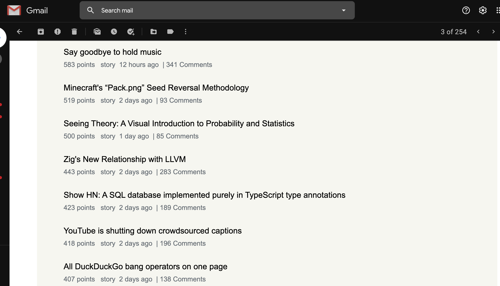

# Learning with AWS Lambda

This is an educational post about using AWS and lambda functions. The plan is to run the the cron task that sends out HN newsletter as AWS lambda function. I will also [rewrite](https://github.com/dan-l/aws-python-hn-newsletter) it in Python3 with ayncIO as a learning opportunity. For sending out email, we will be using Amazon SES.

###AWS Lambda

On your AWS account, you will find your lambda functions [here](https://us-west-2.console.aws.amazon.com/lambda). There are plenty to [resources](https://docs.aws.amazon.com/lambda/latest/dg/getting-started.html) to get started on how to use it.

In order to create your lambda deployment package, you will have to upload zipped package of your function. If it exceeds 50mb, you will need to upload it to AWS S3 storage instead. Although I don't need it in my case, I am going to upload it to S3 to try it out. Furthermore, we have AWS CloudFormation that lets you create an application stack via template. This is convinient where you can use the same template across multiple environments. If you don't need eveything CloudFormation offers, you can use AWS SAM (Server Application Model) template that lets you define it quicker. If you have additional dependencies to your lambda function, you will also have to define a layer for the lib code. Here's my final [template](template.yml).

After uploading our function and layer to S3, we can deploy our stack to CloudFormation with the AWS cli. Interestingly, the cli will only upload the diff by comparing against previously uploaded code which makes the upload fast. Upon successful deployment, you will find your lambda function available.

###Monitoring

After your lambda function goes live, there are many tools in [AWS Cloudwatch](https://us-west-2.console.aws.amazon.com/cloudwatch) to help you get visibility into your function. You can
- look up logs from the execution of your function
- create a dashboard to monitor the success/errors of your function
- create alarms that alerts you via Amazon SNS if the errors crossed a threshold.

###Tracing

AWS also has a tracing tool call [AWS XRay](https://us-west-2.console.aws.amazon.com/xray/). We will use it to trace our simple fetch requests which are async and we can see from our trace that async does make a difference for us when we have to fetch a bunch of stories in sucession.

**_Sequential GETs_**

**_Async GETs_**

###Conclusion

With our simple newsletter, we were able to try out various parts of AWS and running a lambda function. Overall, it is interesting to see how many things you can actually do with AWS lambda and there are tons of resources out there to help you get up and running with it.

