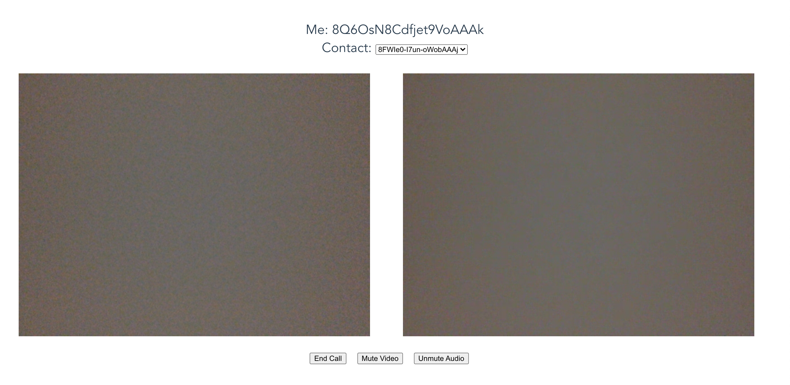

# P2P video

P2P video is short for peer-to-peer video. With our lives getting increasingly digital nowadays, we are able to connect with people who might not be geographically close to us. Video is a great communication tool and p2p serve as the simplest way to get started.

Browser has come a long way from the past and we now have advanced feature like WebRTC where we can take advantage on its offering of real time communication. You can learn more about WebRTC [here](https://webrtc.org/).

A peer does not usually know exactly where the other peer is located for security and privacy reason, and this is where signalling comes in. Signalling allows 2 peers to discover each other via a known server and exchange messages to setup the media exchange. Once both parties have used the signalling message to setup the peer to peer connection, they will be able to exchange media with each other directly.

You can find our simple p2p code using VueJS at [github](https://github.com/dan-l/p2p-video).

**Screenshot**




##### Server

We will setup our simple signalling server to use websocket. This allows us to communiate bi-directionally with the client easily. Here is our NodeJs server using socket.io. To know which client we are sending it to, we will specify an id in our message.

```
io.on('connection', client => {
  console.log('client has connected: ', client.id);
  clients.push(client.id);
  io.sockets.emit('usersList', clients);

  client.on('disconnect', () => {
    console.log('client has disconnected: ', client.id);
    const index = clients.indexOf(client.id);
    clients.splice(index, 1);
    io.sockets.emit('usersList', clients);
  });

  client.on('message', (message) => {
    console.log('sending message: ', message);
    if (!message.id) console.error('Cannot send message to unknown id');
    io.to(message.id).emit('message', message);
  });
});
```

Now the client is able to send messages to each other using our signaling server and then do peer-to-peer media exchange.

##### Client

- Registration and message passing

First client have to register themselves with the server, so that the server will be able to reach them if another client wants to pass a message to them. The peers then will be able to talk to each other via the connected websocket.

 - Peer Connection (PC)

A [PC](https://developer.mozilla.org/en-US/docs/Web/API/RTCPeerConnection) will represent the video session between 2 peers. We will use it to negotiate and manage a connection with our peer.

- Ice Candidates

Potential connection endpoints are known as ICE candidates. PC will find these candidates using ICE framework and when we have them, we will send it to our peer, which our peer will add to their PC. In the end we will both mutually agree on a candidate to let the media start flowing.

Usually networks are hidden behind NAT or firewall, and we can specify ICE servers that will use protocols like [STUN](https://developer.mozilla.org/en-US/docs/Glossary/STUN) or [TURN](https://developer.mozilla.org/en-US/docs/Glossary/TURN) to coordinate the connection between 2 peers on different network.

```
// sending new ICE candidates
const message = {
  type: 'ice-candidate',
  candidate,
  id: state.contact,
};
dispatch('signaling/sendMessage', message, { root: true });

// receiving ICE candidates
case 'ice-candidate':
   dispatch('video/processIceCandidate', message, { root: true });
   break;
```

- Negotiation

A simple negotiation between 2 peers for a video connection looks like this.

1. A creates an offer, sets the local description on their PC and send this offer to B via signalling.
2. At the same time, A starts sending ice candidates to B.
B receives offer, set the remote description on their PC. Then creates an answer, sets the local description on their PC, and send the answer to A via signalling.
3. At the same time, B starts sending ice candidates to A.
4. Finally, A receives the answer and set the remote description on their PC.

```
/**
 * Respond to remote peer's offer with an answer
 */
async createAnswer ({ dispatch, commit }) {
   let localAnswer = await pc.createAnswer({
    offerToReceiveAudio: true,
    offerToReceiveVideo: true,
  });
  commit('setLocalAnswer', localAnswer);
  await pc.setLocalDescription(localAnswer);
},

/**
 * Callee receives offer, show notification, then set remote description if accept,
 * and send answer
 */
async processOffer ({ state, commit, dispatch }, { offer, contact }) {
  if (state.remoteOffer.sdp === offer.sdp) {
    return;
  }

  commit ('setContact', contact);

  try {
     await new Promise((resolve, reject) =>
       commit('setAwaitAccept', { resolve, reject })
     );

    commit('setRemoteOffer', offer);
    await pc.setRemoteDescription(offer);

    await dispatch('createAnswer');

    const message = {
      type: 'answer',
      answer: state.localAnswer,
      id: contact,
    };
    dispatch('signaling/sendMessage', message, { root: true });
  } catch {
    commit ('setContact', null);
  }
},

/**
 * Callee receives an answer after sending out an offer
 */
async processAnswer ({ state, commit }, { answer }) {
  if (state.remoteAnswer.sdp === answer.sdp || pc.signalingState === 'closed') {
    return;
  }

  commit('setRemoteAnswer', answer);
  await pc.setRemoteDescription(answer);
},
```

- Media

WebRTC allows us to get media from browser via their [getUserMedia API](https://developer.mozilla.org/en-US/docs/Web/API/MediaDevices/getUserMedia). We will then manage the local and remote video streams. Local refer to ourselves while remote is the other peer.

Once we have the streams, we will add the audio and video track to our PC. The peer's PC will also get notified there are new remote tracks available and can decide what to do with it.

We also have to account for when permissions have not been granted to access the media and let the user know.

To turn off camera/audio, we have the choice to either stop the stream completely or stop the emission of media. The difference being that if the stream is stll in used if we did not stop the completely.
To turn it back on, we will grab the track from the new stream via getUserMedia if the track was previously stopped or just enable it again.

One thing to keep in mind here is we are not using new streams for our video connection and we are replacing the track on the sender without needing another round of negotiation. This means we need to update our local stream to replace the same track and to reflect them in our UI.


```
getMedia ({ state }, constraints) {
  return navigator.mediaDevices.getUserMedia(constraints);
},

async getVideoStream ({ commit, dispatch }) {
  const constraints = { video: true, audio: true };
  try {
    const media = await dispatch('getMedia', constraints);
    commit('setLocalStream', media);
    return media;
  } catch (ex) {
    alert(`Unable to start video due to ${ex}`);
  }
},
```

### Follow up

- What would authentication and the expiry of session on signalling server looks like?
- What changes would be needed if we have a conference of participants not just 2 peers?
- How do we prevent users from calling each other at the same time?

